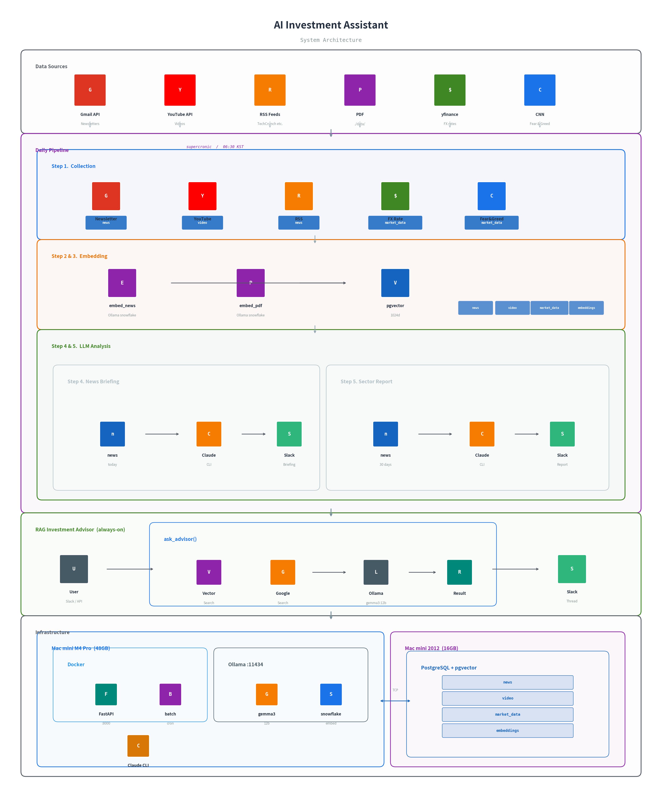

# Financial Investment AI Assistant

Mac mini M4 Pro에서 로컬로 구동되는 투자 분석 AI 백엔드.
뉴스레터, 유튜브 자막, RSS 피드, PDF 리포트를 수집·임베딩하고, RAG 기반 투자 비서와 일간 브리핑을 제공한다.

## 아키텍처


## 인프라

| 구분 | 사양 |
|------|------|
| **WAS** | Mac mini M4 Pro — 14코어 CPU, 20코어 GPU, 48GB 통합 메모리, 1TB SSD |
| **DB** | Mac mini 2012 — Intel i5, 16GB DDR3, 512GB SSD |

모든 연산(LLM 추론 포함)은 로컬에서 수행되며 클라우드 의존 없음.

## 기술 스택

- **언어**: Python 3.10+
- **프레임워크**: FastAPI (비동기)
- **LLM 엔진**: Ollama (localhost:11434) — 실시간 RAG 비서
- **Claude CLI**: 일간 뉴스 정리 · 섹터 리포트 등 고품질 분석 배치
- **LLM 프레임워크**: LangChain + langchain-ollama
- **임베딩 모델**: snowflake-arctic-embed2 (1024차원)
- **LLM 모델**: gemma3:12b (기본)
- **데이터베이스**: PostgreSQL + pgvector (HNSW 인덱스)
- **ORM**: SQLModel (async SQLAlchemy)
- **Slack**: slack-bolt (Socket Mode 봇 + Webhook 알림)
- **컨테이너**: Docker + supercronic (배치 스케줄링)

## 프로젝트 구조

```
├── controller/          # FastAPI 엔드포인트
│   ├── HealthController.py
│   └── AdvisorController.py
├── service/             # 비즈니스 로직 & AI 워크플로우
│   ├── investment_advisor_service.py   # RAG 투자 비서 (Ollama)
│   ├── embedding_service.py           # 임베딩 생성 & 벡터 검색
│   ├── news_service.py                # 뉴스레터 수집
│   ├── youtube_service.py             # 유튜브 영상·자막 수집
│   ├── rss_news_service.py            # RSS 피드 수집
│   ├── news_organize_service.py       # 일간 뉴스 정리 (Claude CLI)
│   ├── daily_report_service.py        # 섹터 추천 리포트 (Claude CLI)
│   ├── market_data_service.py         # 환율·공포탐욕지수 수집
│   └── slack_notification_service.py  # Slack 알림
├── external/            # 외부 연동 모듈
│   ├── ollama_client.py               # Ollama LLM/임베딩 클라이언트
│   ├── gmail_client.py                # Gmail API
│   ├── youtube_client.py              # YouTube Data API
│   ├── rss_client.py                  # RSS 파싱
│   ├── google_search_client.py        # Google Custom Search API
│   ├── slack_bot.py                   # Slack Socket Mode 봇
│   ├── slack_client.py                # Slack Webhook
│   ├── pdf_parser.py                  # PDF 텍스트 추출
│   ├── exchang_rate.py                # 환율 (yfinance)
│   ├── fear_greed_client.py           # CNN 공포탐욕지수
│   └── db/                            # DB 레이어
│       ├── model/                     #   ORM 모델
│       └── repository/                #   CRUD 메서드
├── batch/               # 배치 작업 (ETL)
│   ├── daily_pipeline.py              # 전체 파이프라인 순차 실행
│   ├── daily_collector.py             # 일간 데이터 수집
│   ├── daily_summary.py               # 일간 뉴스 브리핑 → Slack
│   ├── daily_report.py                # 섹터 추천 리포트 → Slack
│   ├── embed_news.py                  # 뉴스 일괄 임베딩
│   ├── embed_pdf.py                   # PDF 파싱·청킹·임베딩
│   └── initial_collector.py           # 초기 히스토리 수집
├── config/              # 설정
│   └── env_setting.py                 # Pydantic Settings (.env 로드)
├── main.py              # FastAPI 앱 진입점
├── Dockerfile           # 멀티스테이지 빌드 (python:3.11-slim)
├── docker-compose.yml   # app(FastAPI) + batch(supercronic) 서비스
├── crontab              # supercronic 스케줄 (매일 06:30 KST)
├── db.sql               # PostgreSQL DDL
└── requirements.txt
```

## 주요 기능

### 데이터 수집
- **뉴스레터**: Gmail API로 구독 뉴스레터 자동 수집
- **유튜브**: YouTube Data API + 자막 추출 (한/영)
- **RSS 피드**: TechCrunch, Ars Technica 등 기술 뉴스
- **PDF**: `./data/pdf/` 디렉토리의 문서 자동 파싱·청킹
- **시장 데이터**: USD/KRW 환율 (yfinance), CNN 공포탐욕지수

### AI 분석

| 기능 | 엔진 | 설명 |
|------|------|------|
| **RAG 투자 비서** | Ollama (gemma3:12b) | 벡터 검색 + 웹 검색(Google CSE) + LLM 추론으로 실시간 답변 |
| **일간 뉴스 브리핑** | Claude CLI | 당일 수집 뉴스를 주제별로 재편성, Slack mrkdwn 포맷 출력 |
| **섹터 추천 리포트** | Claude CLI | 최근 30일 뉴스 기반 섹터별 투자 등급(매수/관망/매도) + 종합 분석 |

### LLM 이중 구조

프로젝트는 두 가지 LLM을 용도에 따라 나누어 사용한다.

**Ollama (로컬 LLM)** — 실시간 대화용
- Slack 봇 멘션 및 REST API를 통한 RAG 투자 비서
- pgvector 벡터 검색 + Google Custom Search 결과를 컨텍스트로 제공
- `langchain-ollama`로 비동기 호출

**Claude CLI** — 배치 분석용
- `claude -p "{prompt}"` 형태로 서브프로세스 호출 (`asyncio.create_subprocess_exec`)
- 뉴스 정리: 여러 뉴스레터를 주제별로 통합 재구성 (타임아웃 5분)
- 섹터 리포트: 30일치 뉴스 분석 → JSON 섹터 데이터 + 마크다운 리포트 (타임아웃 10분)
- 긴 컨텍스트와 복잡한 구조화 출력이 필요한 작업에 활용

### 전달
- **REST API**: `/api/advisor/ask` 엔드포인트
- **Slack Bot**: `@봇` 멘션으로 스레드 기반 멀티턴 대화
- **Slack Webhook**: 일간 브리핑·리포트 자동 전송

## API

```
GET  /           → 서버 정보
GET  /health     → 서버 & DB 상태 확인
POST /api/advisor/ask → RAG 투자 비서 질의
```

**POST /api/advisor/ask**

```json
// Request
{
  "question": "최근 반도체 시장 동향은?",
  "context_limit": 5
}

// Response
{
  "answer": "...",
  "sources": [
    {
      "source_type": "news",
      "source_id": 42,
      "score": 0.87,
      "metadata": { "source": "머니레터", "upload_date": "2026.02.18" }
    }
  ],
  "context_count": 5,
  "web_results_count": 3
}
```

## 설치 & 실행

### 사전 요구사항

- Python 3.10+
- PostgreSQL (pgvector 확장 설치)
- Ollama
- Claude CLI (`npm install -g @anthropic-ai/claude-code`)

### 설정

```bash
# 1. 의존성 설치
pip install -r requirements.txt

# 2. PostgreSQL 스키마 생성
psql -f db.sql

# 3. Ollama 모델 다운로드
ollama pull gemma3:12b
ollama pull snowflake-arctic-embed2

# 4. 환경 변수 설정
cp env.example .env   # 각 항목 값 입력
```

### Docker 실행 (권장)

```bash
# 이미지 빌드 + 컨테이너 시작
docker compose up -d --build

# 서버 정상 확인
curl http://localhost:8000/health

# 배치 수동 테스트
docker compose exec batch python -m batch.daily_pipeline

# 로그 확인
docker compose logs -f app
docker compose logs -f batch
```

- **app**: FastAPI 서버 (포트 8000, `restart: unless-stopped`)
- **batch**: supercronic으로 매일 06:30 KST에 `daily_pipeline` 자동 실행

### 로컬 실행 (개발용)

```bash
# 서버
uvicorn main:app --reload --host 0.0.0.0 --port 8000

# 배치 — 전체 파이프라인
python -m batch.daily_pipeline

# 배치 — 개별 실행
python -m batch.embed_news
python -m batch.embed_pdf
python -m batch.daily_summary
python -m batch.daily_report

# 초기 히스토리 수집 (최초 1회)
python -m batch.initial_collector --days 30
```

## 환경 변수

| 변수 | 설명 |
|------|------|
| `DB_HOST`, `DB_PORT`, `DB_NAME`, `DB_USER`, `DB_PASSWORD` | PostgreSQL 접속 정보 |
| `OLLAMA_HOST` | Ollama 서버 주소 (기본: `http://localhost:11434`) |
| `LLM_MODEL` | LLM 모델명 (기본: `gemma3:12b`) |
| `EMBED_MODEL` | 임베딩 모델명 (기본: `snowflake-arctic-embed2`) |
| `YOUTUBE_API_KEY` | Google API 키 (YouTube + Custom Search 공용) |
| `YOUTUBE_CHANNEL_HANDLES` | 수집 대상 유튜브 채널 핸들 (콤마 구분) |
| `GOOGLE_CSE_ID` | Google Custom Search Engine ID (선택) |
| `NEWS_SENDER_EMAILS` | 뉴스레터 발신자 이메일 (콤마 구분) |
| `RSS_FEED_URLS` | RSS 피드 URL (콤마 구분) |
| `SLACK_BOT_TOKEN` | Slack Bot 토큰 (`xoxb-...`) |
| `SLACK_APP_TOKEN` | Slack App 토큰 (`xapp-...`) |
| `SLACK_WEBHOOK_URL` | Slack 일반 알림 Webhook |
| `SLACK_SUMMARY_WEBHOOK_URL` | 일간 브리핑 Webhook |
| `SLACK_REPORT_WEBHOOK_URL` | 섹터 리포트 Webhook |

## 데이터 흐름

`daily_pipeline` (매일 06:30 KST, supercronic) 이 아래 5단계를 순차 실행한다.

```
──── Step 1. 수집 ───────────────────────────────────────────────

Gmail (뉴스레터) ──┐
RSS (기술 뉴스)  ──┴──→ news 테이블
YouTube (자막)   ─────→ video 테이블
yfinance (환율)  ─────→ exchange_rate_history 테이블
CNN (공포탐욕)   ─────→ fear_greed_index 테이블

──── Step 2. 뉴스 임베딩 ───────────────────────────────────────

news 테이블 → embed_all_news() → embeddings 테이블 (pgvector)

──── Step 3. PDF 임베딩 ────────────────────────────────────────

./data/pdf/*.pdf → 파싱·청킹 → embeddings 테이블 (pgvector)

──── Step 4. 뉴스 정리 (Claude CLI) ────────────────────────────

news 테이블 (당일) → Claude CLI → 주제별 통합 브리핑 → Slack

──── Step 5. 섹터 리포트 (Claude CLI) ──────────────────────────

news 테이블 (30일) → Claude CLI → 섹터 추천 리포트 → Slack
```

### RAG 투자 비서 (상시)

```
사용자 질문 (REST API / Slack Bot)
  ├─ search_similar_context()        ← embeddings (news + pdf_chunk)
  └─ google_search_client.search()   ← 웹 검색 (선택)
      ↓
  프롬프트 조합 → Ollama 추론 → 답변
```

## 라이선스

Private
